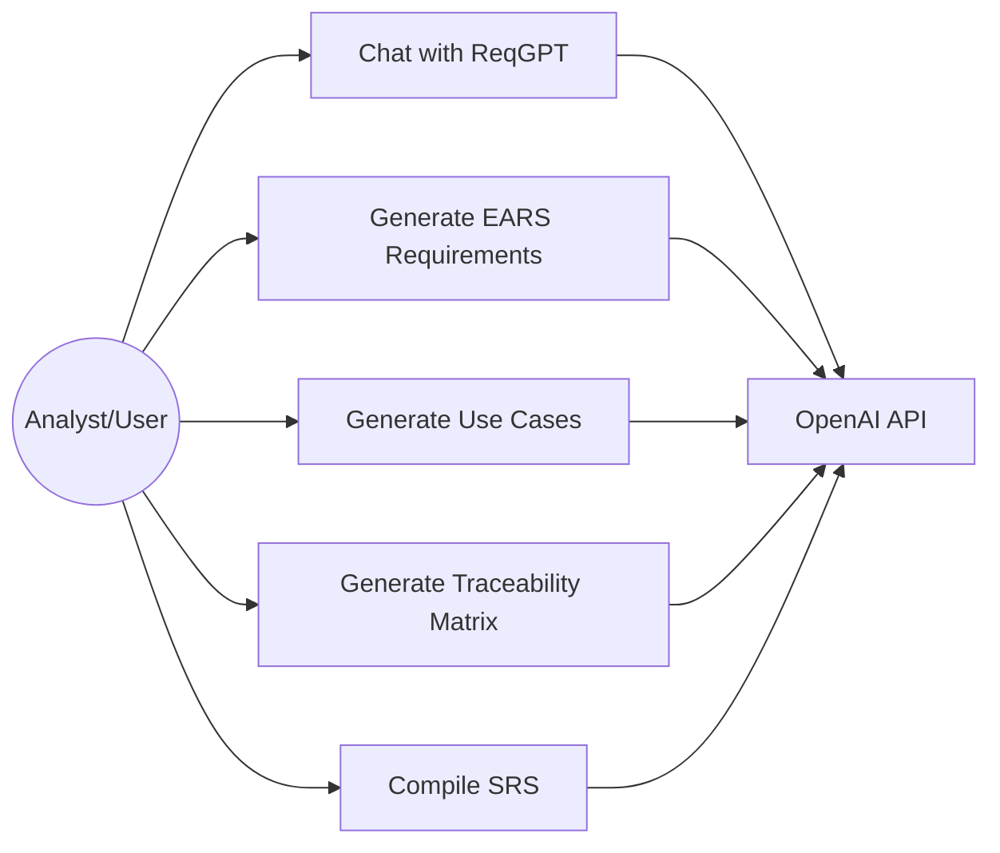

# ReqGPT Requirement Analysis

## 1. Objective
Build a mobile AI assistant that supports requirements elicitation and analysis for software projects.

## 2. Problem Context
Traditional requirements engineering can suffer from missing domain experts, inconsistent analyst experience, ambiguous requirements, and time-consuming manual documentation.

## 3. Solution Scope
ReqGPT provides a chat-based workflow where users enter an initial project idea, answer AI clarification questions, and generate structured artifacts for an SRS.

## 4. Functional Requirements

### FR-01 Project Idea Input
The system shall allow the user to enter an initial project idea or problem statement.

### FR-02 Clarification Chat
When the user submits a project idea, the system shall generate clarification questions for requirements elicitation.

### FR-03 Requirements Generation
When enough project context exists, the system shall generate functional and non-functional requirements in EARS-inspired syntax.

### FR-04 Use Case Generation
When requested by the user, the system shall generate use cases, scenarios, and Mermaid UML use case diagram text.

### FR-05 Traceability Generation
When requested by the user, the system shall generate a traceability matrix mapping user needs to requirements and artifacts.

### FR-06 SRS Compilation
When requested by the user, the system shall compile generated outputs into a Markdown Software Requirements Specification.

### FR-07 API Configuration
The system shall load OpenAI API configuration from an environment file.

## 5. Non-Functional Requirements

### NFR-01 Usability
The app should provide a simple mobile-first chat interface.

### NFR-02 Maintainability
The codebase should separate UI, models, services, and prompt utilities.

### NFR-03 Security
The prototype may use a local `.env` file, but production should use a backend proxy to protect API keys.

### NFR-04 Reliability
If the API key is missing, the app should provide a demo fallback instead of crashing.

## 6. Main Use Cases

### UC-01 Start Requirements Session
Actor: Analyst/User
Goal: Start a new requirements elicitation session.
Main Flow:
1. User opens the app.
2. User enters a project idea.
3. System returns clarification questions.

### UC-02 Generate SRS
Actor: Analyst/User
Goal: Create an SRS draft.
Main Flow:
1. User discusses requirements with ReqGPT.
2. User opens Artifacts.
3. User generates requirements, use cases, traceability, and SRS.
4. System displays generated artifacts.

## 7. Mermaid Use Case Diagram

## 8. Traceability Matrix

| User Need | Requirement | Artifact |
|---|---|---|
| Clarify project scope | FR-01, FR-02 | Chat session |
| Produce standardized requirements | FR-03 | EARS Requirements |
| Visualize system behavior | FR-04 | Use cases, Mermaid UML |
| Maintain alignment | FR-05 | Traceability matrix |
| Create documentation | FR-06 | SRS Markdown |
